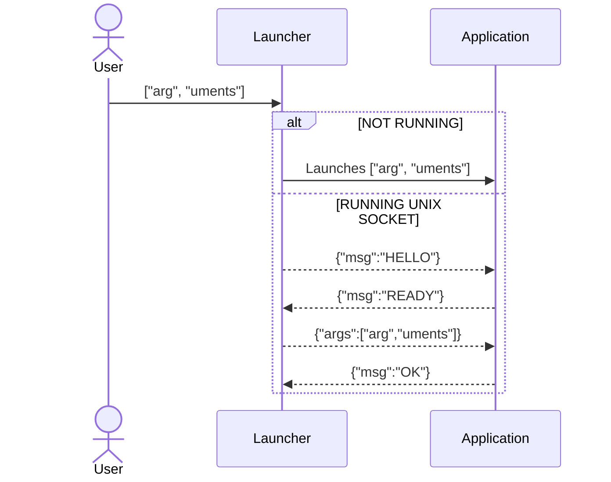

# Native multi-target unix-socket-based launcher

Launcher for single instance application that targets Linux and Windows.

Uses a UNIX socket as a lock and communication channel for the single instance.

If the UNIX socket is not connected to a running instance of the application,
then this program will launch the application, passing arguments through.

If the UNIX socket is connected to a running instance of the application,
then this program will send its arguments to the application via the UNIX socket.

Note that UNIX sockets are supported on Windows starting with Windows 10 RS4 (1803) Version.
For that reason, this launcher requires Windows 10 RS4 as a minimum.

Data is transferred on the UNIX socket using EOL terminated JSON messages in the following sequence:



The logic to resolve the paths to both the UNIX socket and the application's executable is hardcoded in the executable.

Debug builds output expected application messages to stderr for easy testing.
One can use the following `netcat` command to simulate a running application:

```shell
nc -vklU path/to/instance.lock
```
